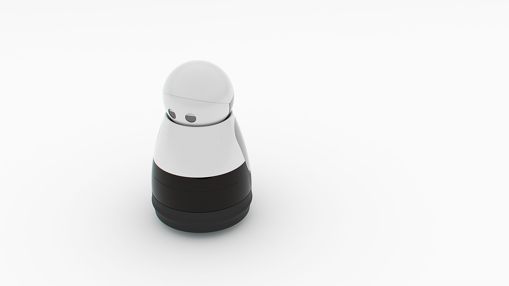

# Project 'KURI'OSITY

### An Attempt to build an Intelligent and Autonomous Home Robot from scratch using opensource technologies.
### Inspired from Kuri by Mayfield Robotics.

You'll be missed Kuri! The cutest robot ever!

## What is Kuriosity?

Kuriosity is an attempt to learn by building an autonomous mobile wheeled robot using state of the art, yet open source technologies and off the shelf components while costing under $700.

## Why Kuriosity?

* Ever since I heard about Kuri during my summer internship at **Fetch Robotics**(They build the Best robots in the world. PERIOD), I wanted to buy one when they become available. But unfortunately, Mayfield [ceased](https://www.heykuri.com/blog/important_difficult_announcement/) the production of Kuri. 

* Being a Robotics enthusiast / Grad student, I had the oppurtunity to work on existing robot platforms (Eg: Clearpath Husky, Turtlebots, MavLink based Drones) and also simulate robots in Gazebo. However, I had the desire to build one by myself to understand the nuances of intricate systems which I usually took for granted (Read publishing joint_states/tf, hardware interfacing, sensor fusion etc).

* Kuriosity will be a test bed to try out different technologies. I'd also use kuriosity for my course work projects.

* Kuriosity will extensively use opensource components, and contribute to them if I manage to fix an issue or come up with an enhancement.

* And of course, Bragging Rights :sunglasses:!!!

## Functionalities Planned

Kuriosity will be a robotic pet / assistant that will have the following functionalities(Expected):

* Kuriosity will be able to localize itself in the environment and be able to plan a path to travel from one location to another.

* Kuriosity will avoid obstacles and replan its path, if an obstacle is present in the previously planned path.

* The robot will be controlled by either a web / mobile based user interface to provide it with commands / tasks.

* Voice recognition and a speaker system that will make the robot a mobile entertainment system.

* Cloud based, easily deployable / upgradable.

* Features like follow a person, home surveillance, intelligent alarm, dropped item recognition etc.  

## Hardware

1. [iRobot Create2 Mobile Base](https://www.irobot.com/About-iRobot/STEM/Create-2.aspx):
    
    Though many options are available for the mobile base, Create2 is chosen for the following reasons:

    * Docking station with IR based fiducials comes prebuilt with the base. No need to develop seperate mechanism for docking.

    * IR and tactile obstacle sensors for obstacle avoidance.

    * Inbuilt wheel encoders for obtaining odometric data.

    Instead of the Create2 and the forthcoming hardware components, Turtlebot3 burger/waffle can also be chosen as it comes with all required sensors and actuators. However I chose to customize the hardware as my motive was to build the robot from scratch(pseudo-scratch).

2. [YDLidar X4 360 degree Lidar](http://ydlidar.com/product/X4):

    This 2D lidar will primarily be used for localization and mapping of the environment. The main reason for opting for this Lidar was because that this lidar has a decent range and scan density for its price point.

3. [Nvidia Jetson TX2](https://developer.nvidia.com/embedded/buy/jetson-tx2-devkit):

    Jetson TX2 is probably the best Single board Computer available, if one does not want to go through the troubles of assembling one from scratch.

4. [Intel Realsense D435 Depth Camera](https://click.intel.com/intelr-realsensetm-depth-camera-d435.html):

    Realsense camera will serve multiple purposes:

    * Gesture / person recognition for person following function.

    * Can help in local planning to update the costmap with obstacles.
    
    * Camera can help in the visual odometry.

## Tech Stack

1. Operating System: Ubuntu 18.04 Bionic

2. ROS : Melodic

3. Docker

(More details to be updated)

## Tasks:

- [x] Hardware Procurement
- [x] Dockerized Environment
- [x] iRobot Create2 ROS interface 
- [x] Realsense ROS interface
- [ ] Mechanical Construction (3D printed Mounts(In Progress))
- [ ] Lidar ROS interface
- [ ] Assembling the robot
- [ ] Code TF publisher node

(More tasks to be updated)

## Tasks currently in Progress:

* Mechanical Construction (3D printed Mounts)
* Lidar ROS interface.
    